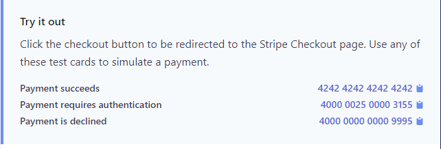

# Getting started

## Requirements

* node
* npm
* mongoDB
* ts-node-dev (nodemon for ts)
* Stripe sdk

## Start Server

First, you have to install dependencies

- `npm i`

Afterwards, you will need to copy the environment variables from .env.example to a new file named `.env`

then start the server using:

- `npm run dev`

# Available endpoints

If you are running the server locally, then the domain will be localhost running on port 5000 (`localhost:5000`)

## Users
- Get `{{base_url}}/v1/users/` with `bearer token` in the headers
- Patch `{{base_url}}/v1/users/` with `bearer token` in the headers
- Delete `{{base_url}}/v1/users/` with `bearer token` in the headers
- Post `{{base_url}}/v1/users/register/:RoleName` with a specified role name in the params (Register Route)
    - Username and password are required in the body
- Post `{{base_url}}/v1/users/login` (login Route)
    - Username and password are required in the body

**Note: only users with admin role can edit roles

## Products

- Get `{{base_url}}/v1/products?limit=x&page=x` with `bearer token` in the headers (all users) w
- Post `{{base_url}}/v1/products/` with `bearer token` in the headers
- Patch `{{base_url}}/v1/products/` with `bearer token` in the headers
- Delete `{{base_url}}/v1/products/` with `bearer token` in the headers

**Note: only users with buyer role can edit roles

## Order

- Get `{{base_url}}/v1/orders?limit=x&page=x` with `bearer token` in the headers
- Post `{{base_url}}/v1/orders/` with `bearer token` in the headers (admin)
- Patch `{{base_url}}/v1/orders/` with `bearer token` in the headers (admin)
- Delete `{{base_url}}/v1/orders/` with `bearer token` in the headers (admin)
- Post `{{base_url}}/v1/orders/buy` with `bearer token` in the headers (buyer) to start the payment process => payment url
- Post `{{base_url}}/v1/orders/response?success=true` or `{{base_url}}/v1/orders/response?success=false` without `bearer token` since this endpoint is a redirect url that renders if transaction is successful or was rejected
- Post `https://ecommerce-basic-joe.herokuapp.com/v1/orders/response?success=true` without authentication is the webhook url. This endpoint uses metadata sent while creating a payment to get the buyer and create an order then delete the user cart.

**Note: The webhook can be secure using hmac.

# Testing Flow

The database is on mongo atlas, thus there is dummy data created in the production url

the production url: `https://ecommerce-basic-joe.herokuapp.com/`

To test the server, there is a postman documentation, and 3 accounts were created with the 3 different roles.

The database holds 4 models:

- `User` which holds user info and the cart that contains a list of products.
- `Product` which holds product data and stripe product id and price id. On any Product creation on this server, a product is created with its associated priceId and both ids are saved in the Product model using Stripe SDK.
- `Role` To reference user roles.
- `Order` Which holds all the data returned by Stripe, the products bought by an order, buyerId and the payment status.

## Testing Flow

Login as a buyer to add products to cart from products/Add to Cart request on postman (No need to add the access_token to postman environment variables, it's done automatically)

Use the orders/Place Order endpoint to create a payment session. This API will return a url, copy and paste this url in your browser and proceed with the payment. You can use the test card 4111 1111 1111 1111 12/29 123 for a successful transaction or use the test cards provided

After finishing the payment, you should be redirected to a page that displays success or canceled depending on weather or not the payment was successful.

Afterwards, a webhook call will be invoked to our server, and and order will be created. You can use the `orders/Get All Orders with pagination request` example to view all orders. This endpoint can filter with status in query params.

## Postman Environment Variables

You will need to set the environment variables and create a new environment to use on postman. You will only need to add the base_url and productId. Examples are `https://ecommerce-basic-joe.herokuapp.com` and `635467cf09a2021e15929bbe` respectively.

# Fixtures

Only Roles model has fixtures that persists admin, buyer, and seller roles
